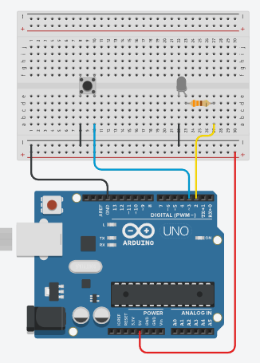

# ArduinoCraft
A mod that converts a redstone signal into Arduino's ```digitalWrite()``` and vise versa.

Please note that this is my first mod, and I'm still learning how to make mods, so there might be some bugs or issues.
## Current feature(s)
- A block called "Arduino Block" which takes redstone signals and converts it to ```digitalWrite()```
- Convert real life signals to redstone with ```digitalRead()```

### Upcoming feature(s)
- (Menu to select the Arduino pin to your desire)
- GUI menu to start or stop the communication


## How to use

### Upload the sketch
Upload the provided [sketch](arduino/example.ino) to your Arduino using the Arduino IDE (or what you use to upload), and connect the pins like this:



### Start
In Minecraft, place down the Arduino Block (from the redstone creative menu), 
plug in your Arduino and run the command ```/arduino start <arduino port> <output/input> <baudrate>```.

Use ```input``` if you want to convert redstone to Arduino, and ```output``` if you want to convert Arduino to redstone.

After that you can connect redstone to it and do whatever you want.
### Stop
Run the command ```/arduino stop```, or if you forgot the port will automatically close when you (save &) quit the game.
## How does it work?
The mod uses the [jSerialComm](https://fazecast.github.io/jSerialComm/) library to communicate with the Arduino through the serial port. 

When you use input, the mod will send a signal to the Arduino everytime the block receives redstone power to write high or low to the pin. 

When you use output, the mod will read if the pin is high or low and send a redstone signal to the block.
## Can I change the circuit?
Yes, since the mod only sends a signal to the Arduino, you can change the circuit to your desire.
Look into the [sketch](arduino/example.ino) to see how the communication works.

TODO: make proper README.md
